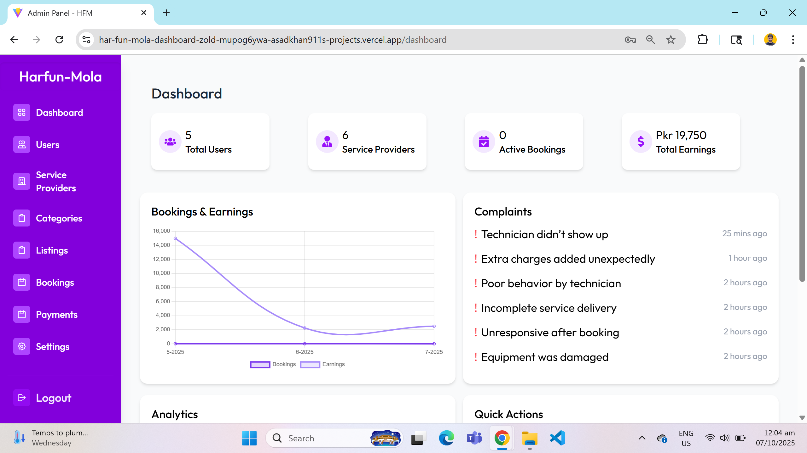
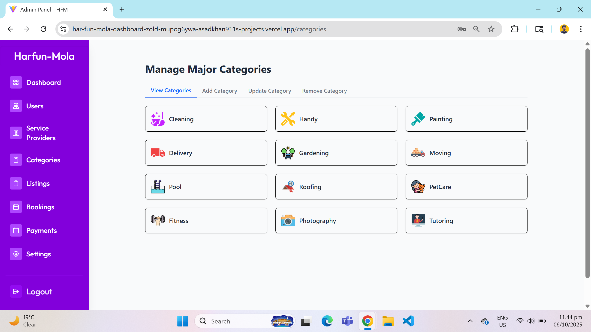
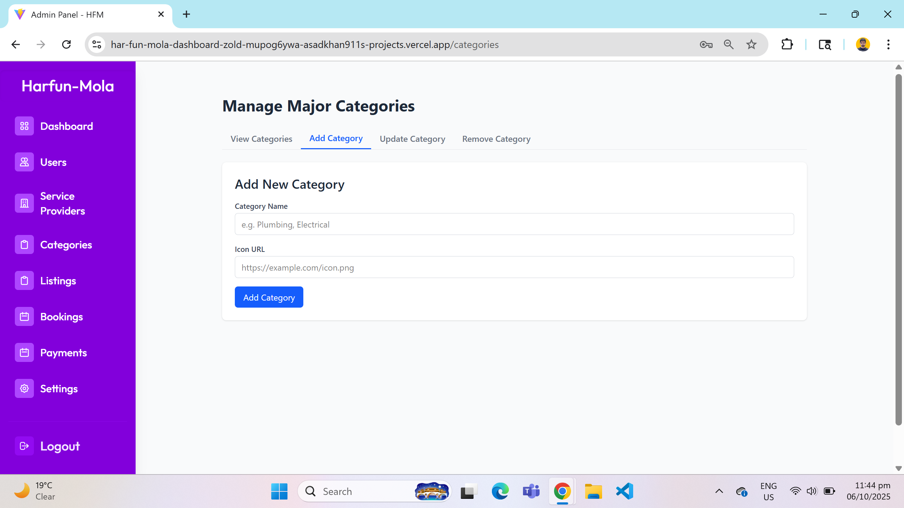

# 📊 Full Stack – HarFun Mola – Admin Dashboard

> ⚠️ **Notice:** The live admin dashboard requires **email and password** to log in.  
> Credentials will be provided **on demand**. Please contact the author if you want access.

Admin Web Dashboard for **HarFun Mola – Smart Home Services App**.  
Built with **React.js, Node.js, Express.js and Tailwind CSS**, the dashboard allows admins to manage users, service providers, bookings, payments, disputes, and platform analytics in real-time.

[🌐 Live Demo](https://har-fun-mola-dashboard-zold-mupog6ywa-asadkhan911s-projects.vercel.app/)

---

## 🔐 Admin Login

Secure login for authorized admins with email and password.

✅ Email verification  
✅ Password recovery  
✅ Profile editing  

<table align="center">
  <tr>
    <td align="center"></td>
  </tr>
  <tr>
    <td align="center"><em>1). Admin Login</em></td>
  </tr>
</table>

---

## 🔑 Key Features

### 1. Dashboard Overview

Get a snapshot of platform activity:

- Total Users & Service Providers  
- Active Bookings & Pending Requests  
- Platform Revenue & Escrow Overview  

<table align="center">
  <tr>
    <td align="center"></td>
    <td align="center"></td>
  </tr>
  <tr>
    <td align="center"><em>1). Dashboard Overview</em></td>
    <td align="center"><em>2). Charts and Tools</em></td>
  </tr>
</table>

---

### 2. User Management

- Add, edit, or remove users  
- Soft disable (ban) accounts if needed  

<table align="center">
  <tr>
    <td align="center"></td>
    <td align="center"></td>
    <td align="center"></td>
  </tr>
  <tr>
    <td align="center"><em>1). Show All Users</em></td>
    <td align="center"><em>2). Add New Users</em></td>
    <td align="center"><em>3). Update Existing Users</em></td>
  </tr>
</table>

---

### 3. Add / Update Service Providers

- Add new service providers  
- Edit provider profiles & verify documents  
- Perform background checks  

<table align="center">
  <tr>
    <td align="center"></td>
    <td align="center"></td>
    <td align="center"></td>
  </tr>
  <tr>
    <td align="center"><em>1). View All Provider</em></td>
    <td align="center"><em>1). Add New Provider</em></td>
    <td align="center"><em>2). Update Existing Provider</em></td>
  </tr>
</table>

---

### 4. Categories & Services

#### Categories

- Manage all categories: view, add, update, remove  

<table align="center">
  <tr>
    <td align="center"></td>
    <td align="center"></td>
  </tr>
  <tr>
    <td align="center"><em>1). View All Categories</em></td>
    <td align="center"><em>2). Add New Categories</em></td>
  </tr>
  <tr>
    <td align="center"></td>
    <td align="center"></td>
  </tr>
  <tr>
    <td align="center"><em>3). Update Existing Categories</em></td>
    <td align="center"><em>4). Remove Categories</em></td>
  </tr>
</table>

#### Service Listings

- Manage services: view, add, update, remove  

<table align="center">
  <tr>
    <td align="center"></td>
    <td align="center"></td>
    <td align="center"></td>

  </tr>
  <tr>
    <td align="center"><em>1). View All Listings</em></td>
    <td align="center"><em>2). Update Existing Listings</em></td>
    <td align="center"><em>2). Ban Existing Listings</em></td>
  </tr>
</table>

---

### 5. Booking & Order Management

- Accept or decline new bookings  
- Monitor order status: Pending → In Progress → Completed  
- Real-time provider location tracking  
- Chat & notifications with users  

<table align="center">
  <tr>
    <td align="center"></td>
    <td align="center"></td>
  </tr>
  <tr>
    <td align="center"><em>1). View All Bookings</em></td>
    <td align="center"><em>2). Update Booking Status</em></td>
  </tr>
</table>

---

### 6. Payments & Escrow System

- Wallet system for providers  
- Escrow payments until job completion  
- View transaction history & generate reports  
- Handle disputes or refunds  

<table align="center">
  <tr>
    <td align="center"></td>
  </tr>
  <tr>
    <td align="center"><em>1). Payments Overview</em></td>
  </tr>
</table>

---

### 7. Multi-Admin Support

- View All Admins  
- Add new admin accounts  

<table align="center">
  <tr>
    <td align="center"></td>
    <td align="center"></td>
  </tr>
  <tr>
    <td align="center"><em>1). View Existing Admins</em></td>
    <td align="center"><em>2). Add New Admins</em></td>
  </tr>
</table>

---

## 🛠️ Tech Stack

| Layer | Technology |
|-------|------------|
| **Frontend** | React, Tailwind CSS, Chart.js |
| **Backend** | Node.js, Express |
| **Database** | MongoDB |
| **Authentication** | JWT / Secure Login |
| **Deployment** | Vercel / Render |

---

## ⚡Run the project locally

Clone the repository, install dependencies, and start both frontend and backend:

```bash

git clone https://github.com/AsadKhan911/HarFunMola-Dashboard.git
cd HarFunMola-Dashboard
cd backend && npm install
cd ../frontend && npm install
# Start backend
cd ../backend && npm start
# Start frontend (in a new terminal)
cd ../frontend && npm start

